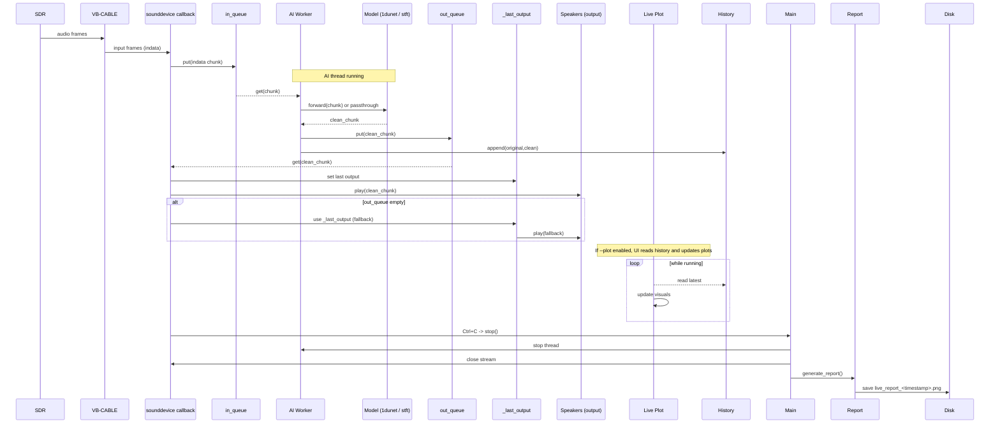

## Live SDR Denoiser (live_denoise.py) — Mermaid diagrams

Below are Mermaid diagrams (flowchart + sequence) that describe the high-level design and runtime data flow of `src/live_denoise.py`.

Flowchart:

```mermaid
flowchart LR
  %% Top-level blocks
  CLI["CLI\n(--mode/--architecture/--model/--passthrough/--input-device/--output-device/--chunk-size/--cpu/--plot)"] --> Init["Instantiate LiveSDRDenoiser\n(load model via FMModelLoader / get_model_for_inference or set passthrough)"]

  subgraph HW["Hardware & Audio"]
    A_in["Input Device\n(CABLE Output)"] -->|audio frames| AudioStream["sounddevice Stream\n(audio callback)"]
    AudioStream --> A_out["Output Device\n(Speakers)"]
  end

  Init --> AudioStream
  Init --> AIThread["AI Thread (_ai_worker)"]
  AudioStream -->|enqueue| InQueue["in_queue (Queue)"]
  AIThread -->|enqueue| OutQueue["out_queue (Queue)"]
  InQueue --> AIThread
  OutQueue --> AudioStream

  subgraph Model["Model / Processing"]
    AIThread -->|loads| ModelLoader["FMModelLoader / get_model_for_inference\n(detect architecture: 1dunet or stft)"]
    ModelLoader --> Model["Model (1dunet or stft) on CPU/GPU"]
    AIThread --> Model
    AIThread -->|passthrough| Passthrough["Passthrough Mode (bypass model)"]
  end

  subgraph LiveUI["Optional UI / Plotting"]
    AudioStream --> LivePlot["Live Plot (enabled with --plot)"]
    AIThread --> LivePlot
  end

  subgraph History["Reporting & History"]
    AIThread --> History["input_history / output_history (deque)"]
    Shutdown["Stop (Ctrl+C) -> denoiser.stop()"] -->|generate| Report["generate_report():\n- waveform\n- spectrograms\n- noise profile\n-> saves live_report_<timestamp>.png"]
    Shutdown -->|cleanup| AudioStream
    Shutdown -->|cleanup| AIThread
  end

  AudioStream -->|fallback| LastOut["_last_output fallback (avoid gaps)"] --> A_out

  style CLI fill:#f8f9fa,stroke:#333,stroke-width:1px
  style Model fill:#fff7e6,stroke:#b36b00
  style LiveUI fill:#e6f7ff,stroke:#007acc
  style History fill:#f0fff0,stroke:#2d7a2d
```

Sequence diagram (detailed runtime flow):



Usage
- Open `docs/live_denoise_mermaid.md` in an editor that supports Mermaid preview (VS Code with 'Markdown Preview Enhanced' or built-in Mermaid support) to view the diagrams.

If you'd like, I can also:
- Save the diagrams as an SVG/PNG (requires running Mermaid CLI or a previewer).
- Create a simplified one-page README that includes the diagrams and quick-run commands.
